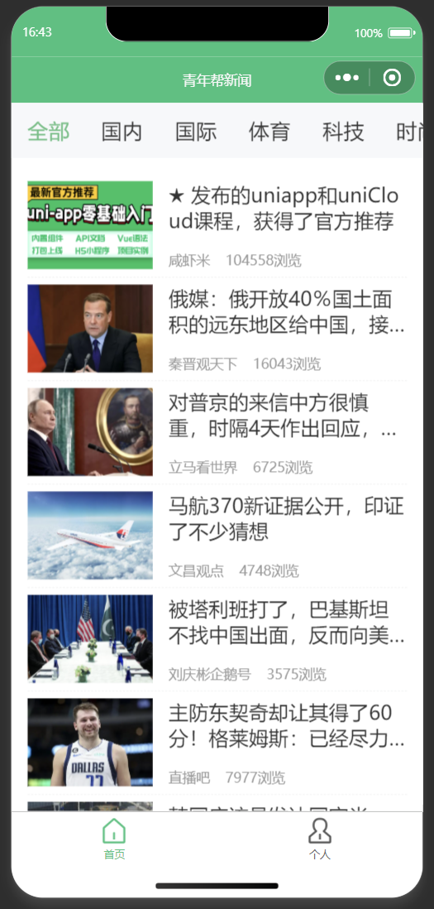

# qingnianbang-news
## 简介

参考b站UP主“咸虾米\_”的课程制作的uniapp小项目：青年帮新闻，这个项目用的都是 uniapp 原生的组件，并且没有用到后端程序，后端接口已经由UP主“咸虾米\_”做好了，可以直接调用，适合初学 uniapp 的新手入门。

如果没有学习过 uniapp ，可以参考 uniapp [官方文档](https://uniapp.dcloud.net.cn/)，或者参考我的[笔记](https://www.yuque.com/u12581613/tr1fwx/rkn6qdseyur1k4am)。

更多详情可参考原视频：https://www.bilibili.com/video/BV1mT411K7nW/。

## 页面

### 首页

### 个人

### 详情

